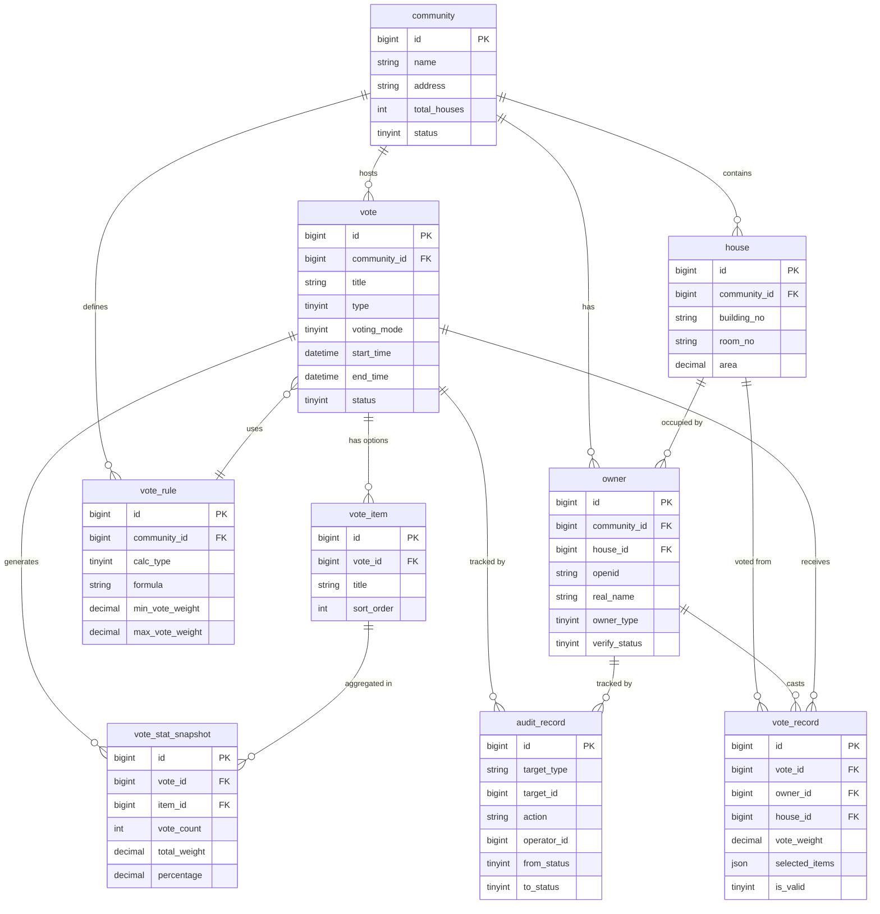

# 业主投票系统 — 技术架构确认与数据库设计

**版本：** V1.0  
**日期：** 2026-05-06  
**技术方案：** Spring Boot 微服务 + Vue 管理后台 + 微信小程序 + MySQL  
**状态：** 已完成

---

## 一、整体技术架构

```
┌─────────────────────────────────────────────────────────┐
│                      用户接入层                           │
│                                                         │
│  ┌─────────────────┐    ┌─────────────────┐             │
│  │   微信小程序     │    │  Vue 管理后台    │             │
│  │  (业主端)        │    │  (物业/业委会)   │             │
│  └────────┬────────┘    └────────┬────────┘             │
└───────────┼─────────────────────┼───────────────────────┘
            │                     │
            ▼                     ▼
┌─────────────────────────────────────────────────────────┐
│                      网关层                              │
│                                                         │
│  ┌─────────────────────────────────────────────────┐   │
│  │       API Gateway (Spring Cloud Gateway)        │   │
│  │   路由转发 | 鉴权 | 限流 | 日志 | HTTPS 终止     │   │
│  └─────────────────────────────────────────────────┘   │
└─────────────────────────────────────────────────────────┘
                            │
                            ▼
┌─────────────────────────────────────────────────────────┐
│                      微服务层                            │
│                                                         │
│  ┌──────────┐ ┌──────────┐ ┌──────────┐ ┌──────────┐  │
│  │ 用户服务  │ │ 投票服务  │ │ 票权服务  │ │ 通知服务  │  │
│  │ user-svc │ │vote-svc  │ │right-svc │ │notify-svc│  │
│  └──────────┘ └──────────┘ └──────────┘ └──────────┘  │
│  ┌──────────┐ ┌──────────┐ ┌──────────┐               │
│  │ 审核服务  │ │ 统计服务  │ │ 文件服务  │               │
│  │audit-svc │ │stats-svc │ │file-svc  │               │
│  └──────────┘ └──────────┘ └──────────┘               │
└─────────────────────────────────────────────────────────┘
                            │
                            ▼
┌─────────────────────────────────────────────────────────┐
│                      数据层                              │
│                                                         │
│  ┌──────────┐  ┌──────────┐  ┌──────────────────┐      │
│  │  MySQL   │  │  Redis   │  │  微信小程序 API   │      │
│  │  (主库)   │  │  (缓存)   │  │  (消息推送)      │      │
│  └──────────┘  └──────────┘  └──────────────────┘      │
└─────────────────────────────────────────────────────────┘
```

### 1.1 技术选型

| 层级 | 组件 | 技术 | 版本 | 说明 |
|-----|------|------|------|------|
| **小程序端** | 框架 | 微信小程序原生 | — | 业主投票入口 |
| **管理后台** | 前端 | Vue 3 + Element Plus | 3.x | 物业/业委会管理 |
| **网关** | API Gateway | Spring Cloud Gateway | 4.x | 统一入口 |
| **微服务** | 框架 | Spring Boot | 3.2+ | 核心业务逻辑 |
| **注册中心** | Nacos | Nacos | 2.x | 服务发现+配置中心 |
| **数据库** | 主库 | MySQL | 8.0 | 关系型存储 |
| **缓存** | Redis | Redis | 7.x | 会话/投票状态缓存 |
| **消息队列** | MQ | RocketMQ / RabbitMQ | — | 异步通知/审核流转 |
| **对象存储** | OSS | 阿里云 OSS / MinIO | — | 投票附件存储 |

---

## 二、数据库 ER 设计

### 2.1 核心表总览

```
┌─────────────┐     ┌─────────────┐     ┌─────────────┐
│  小区表      │1   N│  房屋表      │1   N│  业主表      │
│ community   │◄────│   house     │◄────│  owner      │
└─────────────┘     └─────────────┘     └──────┬──────┘
                                               │
                                        ┌──────┴──────┐
                                        ▼             ▼
                                  ┌──────────┐  ┌──────────┐
                                  │ 投票表    │  │ 票权规则  │
                                  │ vote     │  │vote_rule │
                                  └────┬─────┘  └──────────┘
                                       │
                            ┌──────────┼──────────┐
                            ▼          ▼          ▼
                      ┌────────┐ ┌────────┐ ┌────────┐
                      │ 投票项  │ │ 投票   │ │ 审核   │
                      │vote_item│ │记录    │ │ 记录   │
                      └────────┘ │record  │ │ audit  │
                                 └────────┘ └────────┘
                                       │
                                       ▼
                                 ┌──────────┐
                                 │ 统计快照  │
                                 │stat_snap │
                                 └──────────┘
```

### 2.2 表结构定义

#### 2.2.1 小区表 (community)

```sql
CREATE TABLE community (
    id              BIGINT PRIMARY KEY AUTO_INCREMENT,
    name            VARCHAR(100)    NOT NULL COMMENT '小区名称',
    address         VARCHAR(255)    NOT NULL COMMENT '详细地址',
    city            VARCHAR(50)     NOT NULL COMMENT '城市',
    district        VARCHAR(50)     NOT NULL COMMENT '区/县',
    property_company VARCHAR(100)   COMMENT '物业公司名称',
    total_houses    INT             NOT NULL DEFAULT 0 COMMENT '总房屋数',
    total_area      DECIMAL(12,2)   COMMENT '总面积(㎡)',
    status          TINYINT         NOT NULL DEFAULT 1 COMMENT '状态: 1-启用 0-停用',
    created_at      DATETIME        NOT NULL DEFAULT CURRENT_TIMESTAMP,
    updated_at      DATETIME        NOT NULL DEFAULT CURRENT_TIMESTAMP ON UPDATE CURRENT_TIMESTAMP,
    INDEX idx_city_district (city, district),
    INDEX idx_status (status)
) ENGINE=InnoDB DEFAULT CHARSET=utf8mb4 COMMENT='小区信息表';
```

#### 2.2.2 房屋表 (house)

```sql
CREATE TABLE house (
    id              BIGINT PRIMARY KEY AUTO_INCREMENT,
    community_id    BIGINT          NOT NULL COMMENT '所属小区ID',
    building_no     VARCHAR(20)     NOT NULL COMMENT '楼栋号',
    unit_no         VARCHAR(20)     COMMENT '单元号',
    room_no         VARCHAR(20)     NOT NULL COMMENT '房号',
    floor_no        INT             COMMENT '楼层',
    area            DECIMAL(8,2)    NOT NULL COMMENT '建筑面积(㎡)',
    area_type       TINYINT         NOT NULL DEFAULT 1 COMMENT '面积类型: 1-套内 2-建筑',
    status          TINYINT         NOT NULL DEFAULT 1 COMMENT '状态: 1-正常 0-停用',
    created_at      DATETIME        NOT NULL DEFAULT CURRENT_TIMESTAMP,
    updated_at      DATETIME        NOT NULL DEFAULT CURRENT_TIMESTAMP ON UPDATE CURRENT_TIMESTAMP,
    UNIQUE INDEX uk_community_room (community_id, building_no, unit_no, room_no),
    INDEX idx_community (community_id)
) ENGINE=InnoDB DEFAULT CHARSET=utf8mb4 COMMENT='房屋信息表';
```

#### 2.2.3 业主表 (owner)

```sql
CREATE TABLE owner (
    id              BIGINT PRIMARY KEY AUTO_INCREMENT,
    community_id    BIGINT          NOT NULL COMMENT '所属小区ID',
    house_id        BIGINT          NOT NULL COMMENT '关联房屋ID',
    openid          VARCHAR(64)     NOT NULL COMMENT '微信openid',
    union_id        VARCHAR(64)     COMMENT '微信unionid',
    nickname        VARCHAR(50)     COMMENT '昵称',
    avatar_url      VARCHAR(500)    COMMENT '头像URL',
    phone           VARCHAR(20)     COMMENT '手机号',
    real_name       VARCHAR(50)     COMMENT '真实姓名',
    id_card_hash    VARCHAR(64)     COMMENT '身份证号SHA256(脱敏存储)',
    owner_type      TINYINT         NOT NULL DEFAULT 1 COMMENT '业主类型: 1-产权人 2-家属 3-租户',
    verify_status   TINYINT         NOT NULL DEFAULT 0 COMMENT '认证状态: 0-待审核 1-已通过 2-已拒绝',
    verify_remark   VARCHAR(255)    COMMENT '审核备注',
    status          TINYINT         NOT NULL DEFAULT 1 COMMENT '状态: 1-正常 0-停用',
    created_at      DATETIME        NOT NULL DEFAULT CURRENT_TIMESTAMP,
    updated_at      DATETIME        NOT NULL DEFAULT CURRENT_TIMESTAMP ON UPDATE CURRENT_TIMESTAMP,
    UNIQUE INDEX uk_openid (openid),
    INDEX idx_community (community_id),
    INDEX idx_house (house_id),
    INDEX idx_verify_status (verify_status)
) ENGINE=InnoDB DEFAULT CHARSET=utf8mb4 COMMENT='业主信息表';
```

#### 2.2.4 投票表 (vote)

```sql
CREATE TABLE vote (
    id              BIGINT PRIMARY KEY AUTO_INCREMENT,
    community_id    BIGINT          NOT NULL COMMENT '所属小区ID',
    title           VARCHAR(200)    NOT NULL COMMENT '投票标题',
    description     TEXT            COMMENT '投票说明',
    type            TINYINT         NOT NULL COMMENT '投票类型: 1-业主大会表决 2-业委会选举 3-物业选聘 4-维修基金 5-其他',
    rule_id         BIGINT          COMMENT '关联票权规则ID',
    voting_mode     TINYINT         NOT NULL DEFAULT 1 COMMENT '投票方式: 1-单选 2-多选 3-权重打分',
    max_choices     INT             DEFAULT 1 COMMENT '最多可选数(多选时)',
    start_time      DATETIME        NOT NULL COMMENT '开始时间',
    end_time        DATETIME        NOT NULL COMMENT '结束时间',
    status          TINYINT         NOT NULL DEFAULT 0 COMMENT '状态: 0-草稿 1-待审核 2-审核通过 3-审核拒绝 4-进行中 5-已结束 6-已作废',
    creator_id      BIGINT          NOT NULL COMMENT '创建人ID(业委会/物业)',
    attachment_urls JSON            COMMENT '附件URL列表',
    publish_time    DATETIME        COMMENT '发布时间',
    result          JSON            COMMENT '投票结果快照',
    created_at      DATETIME        NOT NULL DEFAULT CURRENT_TIMESTAMP,
    updated_at      DATETIME        NOT NULL DEFAULT CURRENT_TIMESTAMP ON UPDATE CURRENT_TIMESTAMP,
    INDEX idx_community (community_id),
    INDEX idx_status (status),
    INDEX idx_time (start_time, end_time)
) ENGINE=InnoDB DEFAULT CHARSET=utf8mb4 COMMENT='投票主表';
```

#### 2.2.5 投票选项表 (vote_item)

```sql
CREATE TABLE vote_item (
    id              BIGINT PRIMARY KEY AUTO_INCREMENT,
    vote_id         BIGINT          NOT NULL COMMENT '投票ID',
    title           VARCHAR(200)    NOT NULL COMMENT '选项标题',
    description     TEXT            COMMENT '选项说明',
    sort_order      INT             NOT NULL DEFAULT 0 COMMENT '排序',
    attachment_urls JSON            COMMENT '附件URL列表',
    status          TINYINT         NOT NULL DEFAULT 1 COMMENT '状态: 1-正常 0-停用',
    created_at      DATETIME        NOT NULL DEFAULT CURRENT_TIMESTAMP,
    updated_at      DATETIME        NOT NULL DEFAULT CURRENT_TIMESTAMP ON UPDATE CURRENT_TIMESTAMP,
    INDEX idx_vote (vote_id)
) ENGINE=InnoDB DEFAULT CHARSET=utf8mb4 COMMENT='投票选项表';
```

#### 2.2.6 投票记录表 (vote_record)

```sql
CREATE TABLE vote_record (
    id              BIGINT PRIMARY KEY AUTO_INCREMENT,
    vote_id         BIGINT          NOT NULL COMMENT '投票ID',
    owner_id        BIGINT          NOT NULL COMMENT '投票人ID',
    house_id        BIGINT          NOT NULL COMMENT '关联房屋ID',
    vote_weight     DECIMAL(10,4)   NOT NULL DEFAULT 1.0000 COMMENT '票权权重值',
    selected_items  JSON            NOT NULL COMMENT '选中的选项ID列表',
    vote_time       DATETIME        NOT NULL DEFAULT CURRENT_TIMESTAMP COMMENT '投票时间',
    is_valid        TINYINT         NOT NULL DEFAULT 1 COMMENT '是否有效: 1-有效 0-无效',
    invalid_reason  VARCHAR(255)    COMMENT '无效原因',
    created_at      DATETIME        NOT NULL DEFAULT CURRENT_TIMESTAMP,
    updated_at      DATETIME        NOT NULL DEFAULT CURRENT_TIMESTAMP ON UPDATE CURRENT_TIMESTAMP,
    UNIQUE INDEX uk_vote_owner (vote_id, owner_id),
    INDEX idx_vote (vote_id),
    INDEX idx_owner (owner_id),
    INDEX idx_house (house_id),
    INDEX idx_valid (is_valid)
) ENGINE=InnoDB DEFAULT CHARSET=utf8mb4 COMMENT='投票记录表';
```

#### 2.2.7 票权规则表 (vote_rule)

```sql
CREATE TABLE vote_rule (
    id              BIGINT PRIMARY KEY AUTO_INCREMENT,
    community_id    BIGINT          NOT NULL COMMENT '适用小区ID',
    name            VARCHAR(100)    NOT NULL COMMENT '规则名称',
    description     TEXT            COMMENT '规则描述',
    calc_type       TINYINT         NOT NULL COMMENT '计算方式: 1-一户一票 2-按面积比例 3-面积+户数双过半 4-自定义公式',
    formula         VARCHAR(500)    COMMENT '自定义公式表达式',
    min_vote_weight DECIMAL(10,4)   DEFAULT 0.0000 COMMENT '最低票权值',
    max_vote_weight DECIMAL(10,4)   COMMENT '最高票权值(封顶)',
    is_active       TINYINT         NOT NULL DEFAULT 1 COMMENT '是否启用: 1-是 0-否',
    created_by      BIGINT          COMMENT '创建人ID',
    created_at      DATETIME        NOT NULL DEFAULT CURRENT_TIMESTAMP,
    updated_at      DATETIME        NOT NULL DEFAULT CURRENT_TIMESTAMP ON UPDATE CURRENT_TIMESTAMP,
    INDEX idx_community (community_id)
) ENGINE=InnoDB DEFAULT CHARSET=utf8mb4 COMMENT='票权规则表';
```

#### 2.2.8 审核记录表 (audit_record)

```sql
CREATE TABLE audit_record (
    id              BIGINT PRIMARY KEY AUTO_INCREMENT,
    target_type     VARCHAR(20)     NOT NULL COMMENT '审核对象类型: VOTE/OWNER',
    target_id       BIGINT          NOT NULL COMMENT '审核对象ID',
    action          VARCHAR(20)     NOT NULL COMMENT '操作: SUBMIT/APPROVE/REJECT/CANCEL',
    operator_id     BIGINT          NOT NULL COMMENT '操作人ID',
    operator_role   VARCHAR(20)     NOT NULL COMMENT '操作人角色: PROPERTY/COMMITTEE/ADMIN',
    comment         VARCHAR(500)    COMMENT '审核意见',
    from_status     TINYINT         COMMENT '变更前状态',
    to_status       TINYINT         COMMENT '变更后状态',
    created_at      DATETIME        NOT NULL DEFAULT CURRENT_TIMESTAMP,
    INDEX idx_target (target_type, target_id),
    INDEX idx_operator (operator_id),
    INDEX idx_created (created_at)
) ENGINE=InnoDB DEFAULT CHARSET=utf8mb4 COMMENT='审核记录表';
```

#### 2.2.9 统计快照表 (vote_stat_snapshot)

```sql
CREATE TABLE vote_stat_snapshot (
    id              BIGINT PRIMARY KEY AUTO_INCREMENT,
    vote_id         BIGINT          NOT NULL COMMENT '投票ID',
    item_id         BIGINT          NOT NULL COMMENT '选项ID',
    vote_count      INT             NOT NULL DEFAULT 0 COMMENT '投票人数',
    total_weight    DECIMAL(12,4)   NOT NULL DEFAULT 0.0000 COMMENT '总票权值',
    percentage      DECIMAL(5,2)    COMMENT '得票比例(%)',
    snapshot_time   DATETIME        NOT NULL DEFAULT CURRENT_TIMESTAMP COMMENT '统计时间点',
    created_at      DATETIME        NOT NULL DEFAULT CURRENT_TIMESTAMP,
    INDEX idx_vote (vote_id),
    INDEX idx_item (item_id),
    INDEX idx_snapshot_time (snapshot_time)
) ENGINE=InnoDB DEFAULT CHARSET=utf8mb4 COMMENT='投票统计快照表';
```

### 2.3 ER 关系图（Mermaid）



---

## 三、票权规则引擎抽象设计

### 3.1 规则引擎架构

```
┌─────────────────────────────────────────────────────────┐
│                    票权规则引擎                           │
│                                                         │
│  ┌─────────────┐    ┌─────────────┐    ┌─────────────┐ │
│  │  规则解析器  │───▶│  权重计算器  │───▶│  结果验证器  │ │
│  │ RuleParser  │    │ WeightCalc  │    │ Validator   │ │
│  └──────┬──────┘    └──────┬──────┘    └──────┬──────┘ │
│         │                  │                  │         │
│         ▼                  ▼                  ▼         │
│  ┌──────────────────────────────────────────────────┐  │
│  │              规则策略接口                          │  │
│  │           VoteWeightStrategy                     │  │
│  │  ┌────────┐ ┌────────┐ ┌────────┐ ┌────────┐   │  │
│  │  │一户一票 │ │面积比例 │ │双过半  │ │自定义  │   │  │
│  │  │Strategy│ │Strategy│ │Strategy│ │Strategy│   │  │
│  │  └────────┘ └────────┘ └────────┘ └────────┘   │  │
│  └──────────────────────────────────────────────────┘  │
└─────────────────────────────────────────────────────────┘
```

### 3.2 核心接口定义

```java
/**
 * 票权计算策略接口
 */
public interface VoteWeightStrategy {

    /**
     * 计算业主在特定投票中的票权值
     *
     * @param context  票权计算上下文（业主、房屋、投票、规则信息）
     * @return 票权权重值
     */
    BigDecimal calculate(VoteWeightContext context);

    /**
     * 获取支持的计算类型
     * @return calc_type 枚举值
     */
    int getCalcType();

    /**
     * 验证票权计算结果是否合法
     * @param weight 票权值
     * @param rule   规则配置
     * @return 是否合法
     */
    boolean validate(BigDecimal weight, VoteRule rule);
}
```

### 3.3 上下文对象

```java
@Data
@Builder
public class VoteWeightContext {
    /** 业主信息 */
    private Owner owner;

    /** 房屋信息 */
    private House house;

    /** 投票信息 */
    private Vote vote;

    /** 票权规则 */
    private VoteRule rule;

    /** 小区总面积 */
    private BigDecimal totalArea;

    /** 小区总户数 */
    private Integer totalHouses;

    /** 业主在该小区的房屋列表（可能拥有多套） */
    private List<House> ownerHouses;
}
```

### 3.4 策略实现

#### 3.4.1 一户一票策略

```java
@Component
public class OneHouseOneVoteStrategy implements VoteWeightStrategy {

    @Override
    public int getCalcType() { return 1; }

    @Override
    public BigDecimal calculate(VoteWeightContext ctx) {
        // 每户固定一票，不考虑面积
        return BigDecimal.ONE;
    }

    @Override
    public boolean validate(BigDecimal weight, VoteRule rule) {
        return weight.compareTo(BigDecimal.ZERO) > 0;
    }
}
```

#### 3.4.2 面积比例策略

```java
@Component
public class AreaRatioStrategy implements VoteWeightStrategy {

    @Override
    public int getCalcType() { return 2; }

    @Override
    public BigDecimal calculate(VoteWeightContext ctx) {
        BigDecimal houseArea = ctx.getHouse().getArea();
        BigDecimal totalArea = ctx.getTotalArea();

        if (totalArea.compareTo(BigDecimal.ZERO) == 0) {
            return BigDecimal.ZERO;
        }

        // 票权 = 房屋面积 / 小区总面积
        BigDecimal weight = houseArea.divide(totalArea, 4, RoundingMode.HALF_UP);

        // 应用封顶/保底
        return applyBounds(weight, ctx.getRule());
    }

    private BigDecimal applyBounds(BigDecimal weight, VoteRule rule) {
        if (rule.getMinVoteWeight() != null) {
            weight = weight.max(rule.getMinVoteWeight());
        }
        if (rule.getMaxVoteWeight() != null) {
            weight = weight.min(rule.getMaxVoteWeight());
        }
        return weight;
    }

    @Override
    public boolean validate(BigDecimal weight, VoteRule rule) {
        return weight.compareTo(BigDecimal.ZERO) > 0;
    }
}
```

#### 3.4.3 面积+户数双过半策略

```java
/**
 * 《民法典》第278条：业主共同决定事项，应当由专有部分面积占比三分之二以上
 * 的业主且人数占比三分之二以上的业主参与表决。
 * 决定前款第六项至第八项规定的事项，应当经参与表决专有部分面积四分之三
 * 以上的业主且参与表决人数四分之三以上的业主同意。
 * 决定前款其他事项，应当经参与表决专有部分面积过半数的业主且参与表决
 * 人数过半数的业主同意。
 */
@Component
public class DualMajorityStrategy implements VoteWeightStrategy {

    @Override
    public int getCalcType() { return 3; }

    @Override
    public BigDecimal calculate(VoteWeightContext ctx) {
        // 双过半策略返回的是一个复合权重对象
        // 同时记录面积权重和人数权重，用于后续双维度统计
        BigDecimal areaWeight = ctx.getHouse().getArea();
        BigDecimal personWeight = BigDecimal.ONE;

        // 编码为复合权重：areaWeight * 10000 + personWeight
        // 实际存储中会拆分为两个字段分别统计
        return areaWeight; // 主权重返回面积值，人数权重在 vote_record 中单独标记
    }

    /**
     * 判断投票是否通过（双过半校验）
     */
    public boolean isPassed(DualMajorityResult result, Vote vote) {
        boolean areaQuorum = result.getParticipatingAreaRatio()
                .compareTo(new BigDecimal("0.6667")) >= 0;
        boolean personQuorum = result.getParticipatingPersonRatio()
                .compareTo(new BigDecimal("0.6667")) >= 0;

        if (!areaQuorum || !personQuorum) {
            return false; // 未达到参与门槛
        }

        // 根据投票类型判断同意比例
        BigDecimal requiredRatio = vote.getType() >= 6
                ? new BigDecimal("0.75")   // 重大事项：四分之三
                : new BigDecimal("0.5");   // 一般事项：过半数

        return result.getAgreeAreaRatio().compareTo(requiredRatio) >= 0
                && result.getAgreePersonRatio().compareTo(requiredRatio) >= 0;
    }

    @Override
    public boolean validate(BigDecimal weight, VoteRule rule) {
        return weight.compareTo(BigDecimal.ZERO) > 0;
    }
}
```

#### 3.4.4 自定义公式策略

```java
@Component
public class CustomFormulaStrategy implements VoteWeightStrategy {

    private final ExpressionParser parser = new SpelExpressionParser();

    @Override
    public int getCalcType() { return 4; }

    @Override
    public BigDecimal calculate(VoteWeightContext ctx) {
        String formula = ctx.getRule().getFormula();
        if (formula == null || formula.isEmpty()) {
            throw new IllegalArgumentException("自定义公式不能为空");
        }

        EvaluationContext evalCtx = new StandardEvaluationContext();
        evalCtx.setVariable("area", ctx.getHouse().getArea());
        evalCtx.setVariable("totalArea", ctx.getTotalArea());
        evalCtx.setVariable("totalHouses", ctx.getTotalHouses());
        evalCtx.setVariable("ownerHouseCount", ctx.getOwnerHouses().size());
        evalCtx.setVariable("floor", ctx.getHouse().getFloorNo());

        Object result = parser.parseExpression(formula).getValue(evalCtx);
        return new BigDecimal(result.toString());
    }

    @Override
    public boolean validate(BigDecimal weight, VoteRule rule) {
        return weight.compareTo(BigDecimal.ZERO) >= 0;
    }
}
```

### 3.5 规则引擎工厂

```java
@Service
public class VoteWeightEngine {

    private final Map<Integer, VoteWeightStrategy> strategies;

    public VoteWeightEngine(List<VoteWeightStrategy> strategyList) {
        this.strategies = strategyList.stream()
                .collect(Collectors.toMap(
                        VoteWeightStrategy::getCalcType,
                        s -> s
                ));
    }

    /**
     * 根据规则类型计算票权
     */
    public BigDecimal calculateWeight(VoteWeightContext context) {
        VoteWeightStrategy strategy = strategies.get(
                context.getRule().getCalcType()
        );
        if (strategy == null) {
            throw new UnsupportedCalcTypeException(
                    "不支持的票权计算类型: " + context.getRule().getCalcType()
            );
        }
        BigDecimal weight = strategy.calculate(context);
        if (!strategy.validate(weight, context.getRule())) {
            throw new InvalidWeightException("票权计算结果不合法");
        }
        return weight;
    }
}
```

---

## 四、审核流程状态机设计

### 4.1 投票审核状态机

```
                    ┌─────────┐
                    │  草稿    │
                    │ DRAFT   │
                    │  (0)    │
                    └────┬────┘
                         │ 提交审核
                         ▼
                    ┌─────────┐
              ┌────▶│ 待审核   │◀───────┐
              │     │PENDING  │         │ 重新提交
              │     │  (1)    │         │
              │     └────┬────┘         │
              │          │              │
        审核通过│    审核拒绝│            │
              │          ▼              │
              │     ┌─────────┐         │
              │     │审核拒绝  │─────────┘
              │     │ REJECTED│  修改后
              │     │  (3)    │
              │     └─────────┘
              ▼
         ┌─────────┐          时间到
         │审核通过  │──────────────────┐
         │APPROVED │                   ▼
         │  (2)    │            ┌─────────┐
         └─────────┘            │ 进行中   │
              │                 │ ONGOING │
              │ 作废             │  (4)    │
              ▼                 └────┬────┘
         ┌─────────┐                 │ 时间到/手动结束
         │ 已作废   │                 ▼
         │ CANCELLED│           ┌─────────┐
         │  (6)    │           │ 已结束   │
         └─────────┘           │ COMPLETED│
                               │  (5)    │
                               └─────────┘
```

### 4.2 状态机实现

```java
/**
 * 投票状态枚举
 */
@Getter
public enum VoteStatus {
    DRAFT(0, "草稿", Set.of(Action.SUBMIT, Action.DELETE)),
    PENDING_REVIEW(1, "待审核", Set.of(Action.APPROVE, Action.REJECT, Action.CANCEL)),
    APPROVED(2, "审核通过", Set.of(Action.PUBLISH, Action.CANCEL)),
    REJECTED(3, "审核拒绝", Set.of(Action.RE_SUBMIT, Action.DELETE)),
    ONGOING(4, "进行中", Set.of(Action.END_EARLY, Action.CANCEL)),
    COMPLETED(5, "已结束", Set.of(Action.ARCHIVE)),
    CANCELLED(6, "已作废", Set.of());

    private final int code;
    private final String label;
    private final Set<Action> allowedActions;

    VoteStatus(int code, String label, Set<Action> allowedActions) {
        this.code = code;
        this.label = label;
        this.allowedActions = allowedActions;
    }

    public boolean canPerform(Action action) {
        return allowedActions.contains(action);
    }

    public static VoteStatus fromCode(int code) {
        return Arrays.stream(values())
                .filter(s -> s.code == code)
                .findFirst()
                .orElseThrow(() -> new IllegalArgumentException("未知状态码: " + code));
    }
}

/**
 * 审核操作枚举
 */
@Getter
public enum Action {
    SUBMIT("提交审核"),
    APPROVE("审核通过"),
    REJECT("审核拒绝"),
    RE_SUBMIT("重新提交"),
    PUBLISH("发布（自动）"),
    END_EARLY("提前结束"),
    CANCEL("作废"),
    DELETE("删除"),
    ARCHIVE("归档");

    private final String label;

    Action(String label) {
        this.label = label;
    }
}

/**
 * 状态机服务
 */
@Service
@RequiredArgsConstructor
public class VoteStateMachine {

    private final AuditRecordMapper auditMapper;
    private final VoteMapper voteMapper;
    private final ApplicationEventPublisher eventPublisher;

    /**
     * 执行状态转换
     */
    @Transactional
    public VoteStatus transit(Long voteId, Action action, Long operatorId,
                               String operatorRole, String comment) {
        Vote vote = voteMapper.selectById(voteId);
        VoteStatus currentStatus = VoteStatus.fromCode(vote.getStatus());

        // 校验操作合法性
        if (!currentStatus.canPerform(action)) {
            throw new InvalidTransitionException(
                    String.format("状态[%s]不允许执行操作[%s]",
                            currentStatus.getLabel(), action.getLabel())
            );
        }

        // 权限校验
        validatePermission(action, operatorRole);

        VoteStatus newStatus = determineNewStatus(currentStatus, action);
        VoteStatus oldStatus = currentStatus;

        // 更新状态
        vote.setStatus(newStatus.getCode());
        if (newStatus == VoteStatus.ONGOING) {
            vote.setPublishTime(LocalDateTime.now());
        }
        voteMapper.updateById(vote);

        // 记录审核日志
        AuditRecord audit = AuditRecord.builder()
                .targetType("VOTE")
                .targetId(voteId)
                .action(action.name())
                .operatorId(operatorId)
                .operatorRole(operatorRole)
                .comment(comment)
                .fromStatus(oldStatus.getCode())
                .toStatus(newStatus.getCode())
                .build();
        auditMapper.insert(audit);

        // 发布状态变更事件
        eventPublisher.publishEvent(
                new VoteStatusChangedEvent(this, voteId, oldStatus, newStatus)
        );

        return newStatus;
    }

    /**
     * 根据当前状态和操作确定目标状态
     */
    private VoteStatus determineNewStatus(VoteStatus current, Action action) {
        return switch (action) {
            case SUBMIT -> VoteStatus.PENDING_REVIEW;
            case APPROVE -> VoteStatus.APPROVED;
            case REJECT -> VoteStatus.REJECTED;
            case RE_SUBMIT -> VoteStatus.PENDING_REVIEW;
            case PUBLISH -> VoteStatus.ONGOING;
            case END_EARLY, CANCEL -> VoteStatus.CANCELLED;
            case DELETE, ARCHIVE -> current; // 物理删除或归档，状态不变
            default -> throw new IllegalArgumentException("未知操作");
        };
    }

    /**
     * 权限校验
     */
    private void validatePermission(Action action, String operatorRole) {
        switch (action) {
            case SUBMIT, RE_SUBMIT, DELETE -> {
                if (!"COMMITTEE".equals(operatorRole) && !"PROPERTY".equals(operatorRole)) {
                    throw new PermissionDeniedException("只有业委会或物业可以提交/删除投票");
                }
            }
            case APPROVE, REJECT -> {
                if (!"ADMIN".equals(operatorRole)) {
                    throw new PermissionDeniedException("只有管理员可以审核");
                }
            }
            case PUBLISH, END_EARLY, CANCEL -> {
                if (!"COMMITTEE".equals(operatorRole)) {
                    throw new PermissionDeniedException("只有业委会可以发布或结束投票");
                }
            }
        }
    }
}
```

### 4.3 业主认证审核状态机

```
              ┌─────────┐
              │  待审核   │
              │PENDING  │
              │  (0)    │
              └────┬────┘
                   │
            ┌──────┴──────┐
            ▼             ▼
       ┌─────────┐   ┌─────────┐
       │ 已通过   │   │ 已拒绝   │
       │ APPROVED│   │ REJECTED│
       │  (1)    │   │  (2)    │
       └─────────┘   └────┬────┘
                          │ 重新提交
                          ▼
                    ┌─────────┐
                    │  待审核   │
                    │PENDING  │
                    └─────────┘
```

---

## 五、核心业务流程

### 5.1 投票创建与发布流程

```
业委会/物业                    系统                      管理员
     │                         │                          │
     │── 1. 创建投票(草稿) ───▶│                          │
     │                         │── 保存状态: DRAFT        │
     │                         │                          │
     │── 2. 提交审核 ─────────▶│                          │
     │                         │── 状态: DRAFT→PENDING    │
     │                         │── 通知管理员              │
     │                         │──────── 审核通知 ───────▶│
     │                         │                          │
     │                         │◀── 3. 审核操作 ──────────│
     │                         │   (通过/拒绝)             │
     │                         │                          │
     │◀── 4. 审核结果通知 ─────│                          │
     │   (通过→发布/拒绝→修改)  │                          │
     │                         │                          │
     │── 5. 发布投票 ─────────▶│                          │
     │                         │── 状态: APPROVED→ONGOING │
     │                         │── 推送小程序消息          │
     │                                                   ▼
                                              业主收到投票通知
```

### 5.2 投票流程

```
业主                          系统
 │                             │
 │── 1. 打开小程序 ───────────▶│
 │                             │── 验证身份 + 业主认证
 │                             │── 检查投票时间范围
 │                             │── 检查是否已投票
 │                             │── 计算票权权重
 │                             │
 │◀── 2. 展示投票详情 + 选项 ──│
 │                             │
 │── 3. 选择选项 + 提交 ──────▶│
 │                             │── 幂等性检查(防重复)
 │                             │── 写入 vote_record
 │                             │── 更新统计快照
 │                             │── 发布投票完成事件
 │                             │
 │◀── 4. 投票成功反馈 ─────────│
```

---

## 六、关键技术要点

### 6.1 幂等性保障

```java
/**
 * 投票防重复提交拦截器
 */
@Aspect
@Component
public class VoteIdempotentAspect {

    @Around("@annotation(voteIdempotent)")
    public Object around(VoteIdempotent voteIdempotent, ProceedingJoinPoint pjp) throws Throwable {
        Long voteId = extractVoteId(pjp);
        Long ownerId = extractOwnerId(pjp);

        String lockKey = String.format("vote:submit:%d:%d", voteId, ownerId);
        Boolean acquired = redisTemplate.opsForValue()
                .setIfAbsent(lockKey, "1", 10, TimeUnit.SECONDS);

        if (Boolean.FALSE.equals(acquired)) {
            throw new DuplicateVoteException("请勿重复提交投票");
        }

        try {
            return pjp.proceed();
        } finally {
            redisTemplate.delete(lockKey);
        }
    }
}
```

### 6.2 实时统计（Redis 缓存 + 定时快照）

```java
@Service
public class VoteStatisticsService {

    /**
     * 投票实时计数（Redis HyperLogLog + Hash）
     */
    public void recordVote(Long voteId, Long itemId, Long ownerId, BigDecimal weight) {
        String voteKey = "vote:count:" + voteId;

        // 使用 HyperLogLog 统计参与人数
        redisTemplate.opsForHyperLogLog().add(voteKey + ":users", ownerId);

        // 使用 Hash 统计各选项得票
        redisTemplate.opsForHash().increment(voteKey + ":items", String.valueOf(itemId), weight.longValue());

        // 总投票数
        redisTemplate.opsForHash().increment(voteKey + ":total", "count", 1);
    }

    /**
     * 定时持久化统计快照（每 5 分钟）
     */
    @Scheduled(fixedRate = 300_000)
    public void persistSnapshots() {
        List<Vote> ongoingVotes = voteMapper.selectByStatus(VoteStatus.ONGOING.getCode());
        for (Vote vote : ongoingVotes) {
            persistSnapshot(vote.getId());
        }
    }
}
```

### 6.3 定时任务：投票自动结束

```java
@Component
public class VoteScheduler {

    /**
     * 每分钟检查是否有投票到期需要自动结束
     */
    @Scheduled(cron = "0 * * * * ?")
    public void checkExpiredVotes() {
        List<Vote> expiredVotes = voteMapper.selectExpiredVotes(LocalDateTime.now());
        for (Vote vote : expiredVotes) {
            voteStateMachine.transit(
                    vote.getId(),
                    Action.END_EARLY,
                    0L, // 系统操作
                    "SYSTEM",
                    "投票时间到期，自动结束"
            );
        }
    }
}
```

---

## 七、数据库索引与性能优化

### 7.1 核心查询场景与索引

| 查询场景 | 查询条件 | 索引策略 |
|---------|---------|---------|
| 业主查看小区投票列表 | community_id + status + 时间 | 联合索引 |
| 检查业主是否已投票 | vote_id + owner_id | 唯一索引 |
| 投票统计查询 | vote_id + is_valid | 普通索引 |
| 审核记录查询 | target_type + target_id | 联合索引 |
| 小区房屋面积汇总 | community_id | 普通索引 |

### 7.2 分表策略（预留）

当单表数据量超过 1000 万行时：
- **vote_record**: 按 vote_id 哈希分表（16 张子表）
- **vote_stat_snapshot**: 按月分表

---

## 八、安全与合规

### 8.1 数据安全

| 安全措施 | 实现方式 |
|---------|---------|
| 身份证号脱敏 | SHA256 哈希存储，不存明文 |
| 投票匿名性 | 投票结果展示不关联业主身份 |
| 投票不可篡改 | vote_record 写入后禁止修改 |
| 接口鉴权 | JWT + 微信小程序登录态 |

### 8.2 合规要求

| 要求 | 实现 |
|-----|------|
| 《民法典》第 278 条 | 双过半策略内置法律校验 |
| 《物业管理条例》 | 票权规则可配置，适配各地法规 |
| 个人信息保护 | 最小化采集，数据脱敏 |

---

## 九、交付物清单

| 序号 | 交付物 | 状态 |
|-----|--------|------|
| 1 | 数据库 ER 设计（9 张核心表） | ✅ 完成 |
| 2 | 票权规则引擎设计（策略模式 + 4 种策略） | ✅ 完成 |
| 3 | 审核流程状态机（投票+业主认证） | ✅ 完成 |
| 4 | 核心业务流程图 | ✅ 完成 |
| 5 | 关键技术实现方案 | ✅ 完成 |
